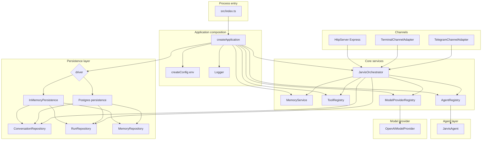
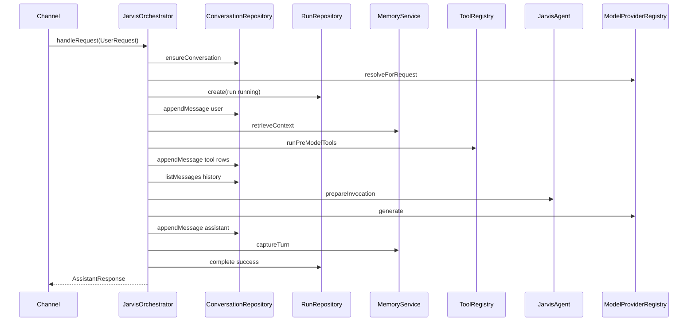

# Jarvis — architecture and module reference

This document describes how **Jarvis** is structured as implemented in this repository: bootstrap, channels (entry points), orchestration, agents, LLM provider, tools, memory, persistence, HTTP API, and configuration.

---

## 1. What Jarvis is (at a glance)

Jarvis is a **single Node.js (TypeScript) application** that:

1. Loads configuration from **environment variables** (`dotenv`).
2. Wires **persistence** (in-memory maps or Postgres), **memory retrieval/writes**, **tool execution** (web search), **model provider** (OpenAI-compatible HTTP), and a single **assistant agent** ("Jarvis").
3. Exposes one or more **channels** — HTTP (`Express`), interactive **terminal**, and optionally **Telegram long-polling** — that funnel user input into **`JarvisOrchestrator.handleRequest`**.
4. Persists **conversations**, **messages**, **runs** (per-request telemetry), optional **conversation summaries**, and **memory entries**.

The orchestrator is the **central coordinator**; channels translate external I/O into `UserRequest` (`src/types/core.ts`).

---

## 2. Repository layout (source modules)

| Area | Path | Role |
|------|------|------|
| Entry | `src/index.ts` | Loads env, `await createApplication()`, shutdown on `SIGINT`/`SIGTERM`, `await application.start()`. |
| Composition root | `src/app/create-application.ts` | Builds config, logger, persistence, memory, tools, models, agents, orchestrator; registers channels; `start` / `stop`. |
| Orchestration | `src/orchestrator/index.ts` | One user turn: conversation, run record, memory, tools, agent prompt, LLM, persistence, capture. |
| Agent | `src/agents/jarvis/index.ts`, `src/agents/registry/index.ts` | Builds `ModelInvocation` (system prompt + truncated history). |
| Models | `src/models/registry.ts`, `src/models/contracts.ts`, `src/models/providers/openai.ts` | Provider selection, `generate` / `embed`. |
| Tools | `src/tools/registry.ts`, `src/tools/web-search.ts` | Pre-model tools (e.g. DuckDuckGo-style search when rules match). |
| Memory | `src/memory/service.ts` | Retrieval (keyword overlap + summary), capture (regex-based facts/preferences), optional rolling summary. |
| Persistence | `src/db/contracts.ts`, `src/db/in-memory.ts`, `src/db/postgres/persistence.ts` | Repositories for conversations, messages, runs, memories. |
| Channels | `src/server/http-server.ts`, `src/channels/terminal/index.ts`, `src/channels/telegram/index.ts`, `src/channels/types.ts` | HTTP / terminal / Telegram implementing `ChannelAdapter`. |
| Config | `src/config/index.ts` | Zod-validated env → `AppConfig`. |
| Types | `src/types/core.ts` | Shared domain types (`UserRequest`, messages, runs, memory, …). |
| Observability | `src/observability/logger.ts` | JSON logs to stdout by level. |
| Utils | `src/utils/id.ts`, `src/utils/text.ts` | IDs, truncation, tokenization, keyword scoring. |
| DB schema (reference) | `db/postgres/schema.sql` | SQL companion; runtime schema also applied in `src/db/postgres/persistence.ts`. |
| Tests | `src/tests/*.test.ts` | Node test runner (`npm test`). |

---

## 3. Architectural diagram (runtime components)

Channels talk **only** to `JarvisOrchestrator`; they do not call providers or repositories directly.

---

## 4. Request lifecycle (one user message)

On failure: `runs.complete` with status `failed` and error message; the error propagates to the channel.

---

## 5. Module-by-module behavior

### 5.1 `src/app/create-application.ts` — composition root

- **`createConfig(process.env)`** → validated `AppConfig`.
- **Persistence:** `PERSISTENCE_DRIVER` → `InMemoryPersistence` or `createPostgresPersistence` (requires `DATABASE_URL` when driver is postgres).
- **`MemoryService`** receives `memories` + `conversations` repositories.
- **`ToolRegistry`**, **`ModelProviderRegistry`**, **`AgentRegistry`** (currently only `JarvisAgent`).
- **`JarvisOrchestrator`** receives orchestration dependencies.
- **Channels:** pushes `HttpServer`, `TelegramChannelAdapter`, `TerminalChannelAdapter` based on `config.channels.*.enabled`.
- **`start`:** starts each channel's `start()` in registration order.
- **`stop`:** stops channels in **reverse** order, then **`persistence.stop()`** (e.g. Postgres pool teardown), logs stop.

### 5.2 `src/orchestrator/index.ts` — orchestration service

- **`ensureConversation`** with optional `conversationId`; title derived from the user message (`toTitleFromMessage`).
- **`ModelProviderRegistry.resolveForRequest`** chooses slot (`fast` / `reasoning` / `default`) via heuristics, or parses `requestedModel` as `openai:model`.
- **Run tracking:** creates `RunRecord` with status `running`, completes with provider/model or error.
- **History for the agent:** loads messages from DB; **tool role messages are filtered out** of the chat history in `JarvisAgent`, while tool outputs are still injected via **system** content from `toolCalls` for that turn.
- **Response:** `AssistantResponse` includes `toolCalls`, `memoryWrites`, optional `usage`.

### 5.3 Agent layer

| File | Responsibility |
|------|----------------|
| `agents/jarvis/index.ts` | Identity prompt, channel/conversation IDs, injects memory summary + memory bullets + tool results; **last 10** non-tool messages as history; returns `ModelInvocation`. The orchestrator's **`generate`** applies the resolved plan's **model** (overriding the invocation's default model field). |
| `agents/registry/index.ts` | Single primary agent via `getPrimary()`; extension point for multiple agents later. |

### 5.4 Model layer — `src/models/registry.ts`

- Registers the **OpenAI-compatible** provider.
- **`listModels()`:** descriptors from configured model names.
- **`resolveForRequest`:** optional `requestedModel` (`model` or `openai:model`); throws if the provider is not configured; slot selection uses regex / message length heuristics.
- **`generate`:** calls primary provider's `generate` directly.

| Provider | File | Behavior |
|----------|------|----------|
| **openai** | `providers/openai.ts` | `fetch` to `{OPENAI_BASE_URL}/chat/completions`. **`OPENAI_BASE_URL` supports OpenAI-compatible third-party gateways.** |

### 5.5 Tools — `src/tools/registry.ts` + `src/tools/web-search.ts`

- **`runPreModelTools`** runs **before** the LLM call.
- **Web search:** DuckDuckGo instant-answer style API; gated by env and **per-channel** flags (currently enabled for terminal/http/telegram in `createConfig`). Triggered by metadata (`allowWebSearch`) or keywords such as "latest", "news", "search", etc.

### 5.6 Memory — `src/memory/service.ts`

- **`retrieveContext`:** latest conversation summary + user memories; ranks by keyword overlap + kind boost; **`MEMORY_RETRIEVAL_LIMIT`**; updates `lastAccessedAt`.
- **`captureTurn`:** regex extracts preferences/facts; skips messages that look **sensitive** (API keys, tokens); optional **`maybeSummarizeConversation`** after enough messages — heuristic summary text, not an LLM-generated summary.

### 5.7 Persistence

| Implementation | Notes |
|----------------|------|
| `src/db/in-memory.ts` | In-process `Map`s; clones on read; bundles conversations + runs + memories. |
| `src/db/postgres/persistence.ts` | `pg` pool, DDL on startup, same repository interfaces; `stop` closes pool. |

Contracts: `src/db/contracts.ts`.

### 5.8 Channels

| Channel | Notes |
|---------|--------|
| **HTTP** (`src/server/http-server.ts`) | `GET /health`, `GET /models`, `GET /conversations/:id`, `GET /conversations/:id/messages`, `POST /chat`, `POST /chat/stream`. The stream route uses SSE but sends **one** event with the **full** JSON result (not token-by-token LLM streaming). |
| **Terminal** (`src/channels/terminal/index.ts`) | Readline; `/new`, `/models`, `/model`, `/search`, `/exit`. |
| **Telegram** (`src/channels/telegram/index.ts`) | Long-polling via `getUpdates` (`TELEGRAM_LONG_POLL_TIMEOUT_SEC`); backoff on errors uses `TELEGRAM_POLL_INTERVAL_MS`; user id `telegram:<from id>`; conversation `telegram:<chat id>`; replies truncated to 4000 chars. |

### 5.9 Configuration — `src/config/index.ts`

- **Zod** `envSchema` maps env vars to `AppConfig` (port, provider, models, memory, persistence, Telegram, …).
- Postgres requires `DATABASE_URL` when `PERSISTENCE_DRIVER=postgres`.

### 5.10 Observability — `src/observability/logger.ts`

Structured **JSON lines** to stdout with level filtering from `LOG_LEVEL`.

---

## 6. Configuration groups (env)

- **App:** `APP_ENV`, `LOG_LEVEL`, `PORT`, `DEFAULT_USER_ID`, `DEFAULT_TEMPERATURE`.
- **Channels:** `ENABLE_HTTP`, `ENABLE_TERMINAL`, `ENABLE_TELEGRAM`, `TELEGRAM_BOT_TOKEN`, `TELEGRAM_POLL_INTERVAL_MS`, `TELEGRAM_LONG_POLL_TIMEOUT_SEC`.
- **Provider:** `OPENAI_API_KEY`, **`OPENAI_BASE_URL`**.
- **Models:** `DEFAULT_MODEL`, `FAST_MODEL`, `REASONING_MODEL`, `EMBEDDING_MODEL`.
- **Tools:** `ENABLE_WEB_SEARCH`, `ALLOW_WEB_SEARCH_BY_DEFAULT`, `WEB_SEARCH_MAX_RESULTS`, `ENABLE_SYSTEM_COM`, `ENABLE_TOOL_ROUTER`.
- **Memory:** `ENABLE_MEMORY`, `AUTO_STORE_MEMORY`, `MEMORY_RETRIEVAL_LIMIT`, `MEMORY_SUMMARY_TRIGGER_MESSAGES`.
- **Persistence:** `PERSISTENCE_DRIVER`, `DATABASE_URL`.

See `src/config/index.ts` and `.env.example` for defaults.

---

## 7. Operational notes

1. **`POST /chat/stream`** does not stream LLM tokens; it wraps the same final payload in SSE.
2. **OpenAI provider** + **`OPENAI_BASE_URL`** is the supported path for **third-party OpenAI-compatible** APIs.
3. **Telegram** currently has web search enabled in `createConfig` (`perChannel.telegram: true`).

---

## Summary

Jarvis is a **channel-agnostic orchestrator** around **one agent**, an **OpenAI-compatible LLM backend**, **optional web search**, **heuristic long-term memory**, and **pluggable persistence**, configured through **Zod-validated** environment variables and wired in **`create-application.ts`**.
